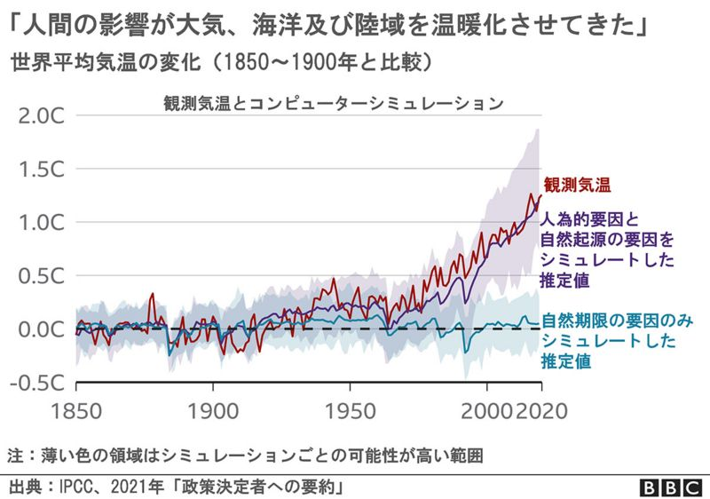
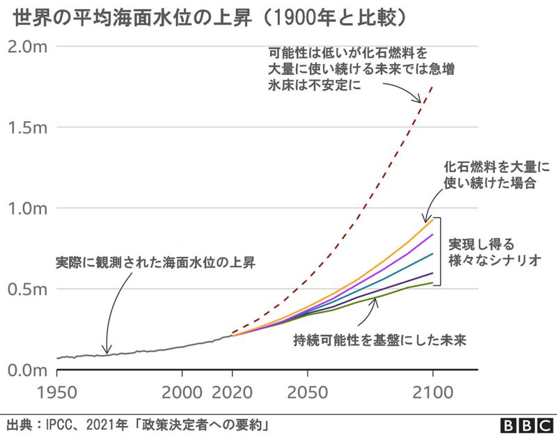

# IPCC AR6 WGI SPM 関連資料

出典元

#### 温暖化は人間が原因＝IPCC報告　「人類への赤信号」と国連事務総長

* https://www.bbc.com/japanese/58142213
* https://www.bbc.com/news/science-environment-58130705

keywords  
エネルギー
気候変動
自然
国連
異常気象
科学
石油ガス産業
環境
自然保護
経済

--- 

* IPCCは、地球温暖化の科学的根拠をまとめた作業部会の最新報告書（第6次評価報告書）を公表。
* 「**人間の影響が大気、海洋及び陸域を温暖化させてきたことには疑う余地がない**。大気、海洋、雪氷圏及び生物圏において、広範囲かつ急速な変化が現れている」と強い調子で、従来より踏み込んで断定
* さらに、「気候システム全般にわたる最近の変化の規模と、気候システムの側面の現在の状態は、**何世紀も何千年もの間、前例のなかったものである**」と指摘
* 「政策決定者への要約」と題された42ページの報告書でIPCCは、国際社会がこれまで設定してきた気温上昇抑制の目標が2040年までに、**早ければ2030年代半ばまでに、突破されてしまう**と指摘。海面水位が今世紀末までに2メートル上昇する可能性も「排除できない」とした
* 「向こう数十年の間に二酸化炭素及びその他の温室効果ガスの排出が大幅に減少しない限り、**21世紀中に、地球温暖化は摂氏1.5℃及び2℃を超える**」と警告
* 国連のアントニオ・グテーレス事務総長は、「**本日のIPCC第1作業部会報告書は、人類への赤信号**」だと発言。「私たちが今、力を結集すれば、気候変動による破局を回避できる。しかし今日の報告がはっきり示したように、対応を遅らせる余裕も、言い訳をしている余裕もない。各国政府のリーダーとすべての当事者（ステークホールダー）が、COP26の成功を確実にしてくれるものと頼りにしている」と述べた
* **国連気候変動枠組条約第26回締約国会議（COP26）は今年11月、英スコットランドのグラスゴーで開催**される。今回のIPCC報告を含め、近年の気候変動の状況を検討した複数の報告書が、COP26に向けてこれから次々と公表される予定
* この報告書は今までになく、温暖化のもたらす壊滅的な打撃を明確に断定している。しかし科学者の間には、2030年までに温室効果ガス排出量を半減できれば、事態は改善できるという期待も出ている。

--- 
### ■■■■ IPCC報告の要旨:現状について ■■■■

* 地球の2011～2020年の地表温度は、1850～1900年に比べて摂氏1.09℃、高かった　
* 過去5年間の気温は1850年以降、最も高かった
* 近年の海面水位の上昇率は1901～1971年に比べて3倍近く増えた
* 1990年代以降に世界各地で起きた氷河の後退および北極海の海氷減少は、90％の確率で人間の影響が原因
* 熱波など暑さの異常気象が1950年代から頻度と激しさを増しているのは「ほぼ確実」
* 一方で寒波など寒さの異常気象は頻度も厳しさも減っている

### ■■■■ IPCC報告:将来への影響について ■■■■

* 温室効果ガス排出量がどう変化するかによる複数のシナリオを検討した結果、どのシナリオでも、地球の気温は2040年までに、1850～1900年水準から1.5℃上昇する
* 全てのシナリオで北極海は2050年までに少なくとも1回は、ほとんどまったく海氷がない状態になる
* 1850～1900年水準からの気温上昇を1.5℃に抑えたとしても、「過去の記録上、前例のない」猛威をふるう異常気象現象が頻度を増して発生する
* 2100年までに、これまで100年に1回起きる程度だった極端な海面水位の変化が、検潮器が設置されている位置の半数以上で、少なくとも1年に1度は起きるようになる
* 多くの地域で森林火災が増える

### ■■■■ 厳然とした事実 ■■■■

* 英レディング大学のエド・ホーキンス教授は、「これは厳然とした事実の表明だ。これ以上はないというくらい確かなことだ。人間がこの惑星を温暖化させている。これは明確で、議論の余地がない」
* 世界気象機関（WMO）のペテリ・ターラス事務局長は、「スポーツ用語を使うなら、地球の大気はドーピングされてしまったと言える。その結果、極端な気象現象が前より頻繁に観測され始めている」
* 報告書の執筆者たちによると、1970年以降の地表温度の上昇は、過去2000年間における50年期間で最も急速なペースだった。こうした温暖化は「すでに地球上のあらゆる地域で、様々な気象や気候の極端な現象に影響している」
* 今年7月以降、北米西部やギリシャなどは極端な熱波に襲われている。あるいはドイツや中国は深刻な水害に見舞われた。過去10年の相次ぐ異常気象が「人間の影響によるものだという結びつきは、強化された」と報告書は指摘
*  IPCCは「過去及び将来の温室効果ガスの排出に起因する多くの変化、特に海洋、氷床及び世界海面水位における変化は、100年から1000年の時間スケールで不可逆的である」と明確に断定
*  海水温度の上昇と酸化は続き、山岳部や極点の氷は今後、数十年もしくは数百年にわたり融け続ける。
*  「ありとあらゆる温暖化の現象について、その影響は悪化し続ける。そして多くの場合、悪影響は引き返しようのないものだ」とホーキンス教授
*  海面水位の上昇については、さまざまなシナリオによるシミュレーションが行われた。それによると、今世紀末までに2メートル上昇する可能性も、2150年までに5メートル上昇する可能性も排除できないとされた

### ■■■■ 「1.5℃上昇」目標は ■■■■

* 地球上のほとんどすべての国は現在、2015年12月に採択された気候変動対策のためのパリ協定に参加している
* パリ協定で各国は、産業革命以前の気温からの気温上昇分を、今世紀中は摂氏2℃より「かなり低く」抑え、1.5℃未満に抑えるための取り組みを推進すると合意
* 「1.5℃」目標について、IPCC報告書は、専門家たちが様々なシナリオを検討した結果、二酸化炭素の排出量が大幅に減らなければ、今世紀中に気温上昇は1.5℃はおろか2℃も突破してしまうと判断を示した
* 「1.5℃上昇」について、報告書執筆者の1人、豪メルボルン大学のマルテ・マインシャウゼン教授は、「個別の年にはそれよりもっと早く、1.5℃上昇に到達する。すでに2016年にはエルニーニョの最中に2カ月間、到達していた」
* 現在の地球の温度はすでに産業革命以前のレベルから1.1℃、上昇している。そして近年、異常気象現象が頻発している。それが今後、何年もかけて1.5℃上昇まで到達するとなると、「ますます激しい熱波が、ますます頻繁に起きる」と、報告書執筆者の1人、英オックスフォード大学のフリーデリケ・オットー博士

### ■■■■ 何ができるのか ■■■■

* 報告書を作成したIPCC1作業部会のカロリーナ・ベラ副議長は、「私たちはすでにあちこちで気候変動の影響を経験していると、報告書は明示している。しかし今後も、温暖化が進むごとに、変化も同時に起こり、私たちはそれをさらに経験することになる」
* 気候変動がもたらす悪影響について、この報告書は今までになく明確に断定。しかし多くの科学者は、2030年までに地球全体の温室効果ガス排出量を半減できれば、気温上昇を食い止め、あるいは反転させることができるかもしれないと、以前より期待を高めている
* 温室効果化ガス実質ゼロ（ネットゼロ）を実現するには、まずクリーンエネルギー技術の利用で可能な限り温室効果ガスを減らした後、残る排出を炭素隔離貯留技術によって回収する、もしくは植林によって吸収するなどの取り組みが必要
* 今回の報告によって、地球温暖化の今後の展望が前より明確に示された。その影響は、避けようがないものが多い。しかし報告書の執筆者たちは、これが運命だと諦めてはいけないと警告
* 「温暖化のレベルを下げれば、事態が一気に悪化する転換点に達してしまう可能性がかなり減らせる。破滅すると決まったわけではない」
* 気候変動における転換点とは、温暖化が続くことで地球の気候システムが急変する時点を意味する