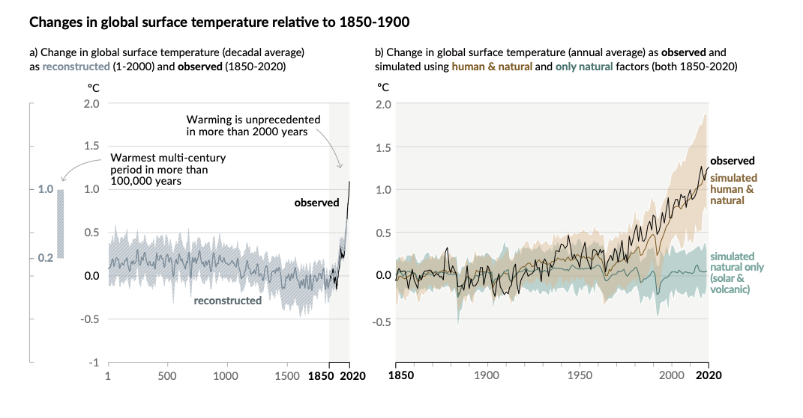
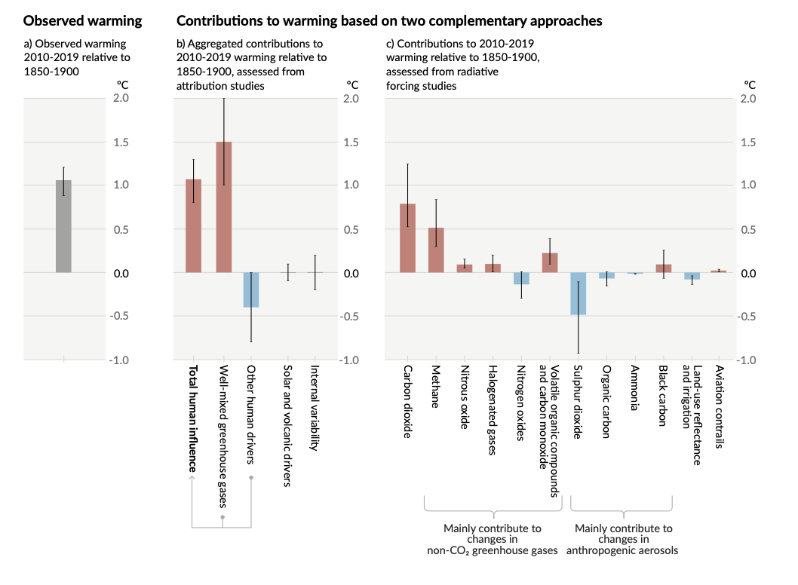

Climate Change 2021, IPCC AR6 WGI
# The Physical Science Basis Summary for Policymakers

original url  
https://www.ipcc.ch/report/ar6/wg1/#SPM

## Introduction

This Summary for Policymakers (SPM) presents key findings of the Working Group I (WGI) contribution to the IPCC’s Sixth Assessment Report (AR6)1 on the physical science basis of climate change. The report builds upon the 2013 Working Group I contribution to the IPCC’s Fifth Assessment Report (AR5) and the 2018–2019 IPCC Special Reports2 of the AR6 cycle and incorporates subsequent new evidence from climate science .

This SPM provides a high-level summary of the understanding of the current state of the climate, including how it is changing and the role of human influence, the state of knowledge about possible climate futures, climate information relevant to regions and sectors, and limiting human-induced climate change.

Based on scientific understanding, key findings can be formulated as statements of fact or associated with an assessed level of confidence indicated using the IPCC calibrated language .

The scientific basis for each key finding is found in chapter sections of the main Report, and in the integrated synthesis presented in the Technical Summary (hereafter TS), and is indicated in curly brackets. The AR6 WGI Interactive Atlas facilitates exploration of these key synthesis findings, and supporting climate change information, across the WGI reference regions .

本報告書は、気候変動の物理科学的基盤に関するIPCCの第6次評価報告書（AR6）1への第1作業部会（WGI）の貢献について、主要な知見をまとめたものである。本報告書は、IPCCの第5次評価報告書（AR5）の2013年第1作業部会報告書およびAR6サイクルの2018-2019年IPCC特別報告書2に基づいて作成されており、その後の気候科学の新たな証拠を取り入れています。

本SPMは、気候がどのように変化しているか、人間の影響がどのような役割を果たしているか、起こりうる気候の未来についての知識の状態、地域やセクターに関連する気候情報、人為的な気候変動の抑制など、気候の現状についての理解をハイレベルでまとめたものです。

重要な知見は、科学的理解に基づいて、事実の記述として、あるいはIPCCの校正済み言語を用いて評価された確信度と関連づけて表現されます。

それぞれの重要な知見の科学的根拠は、本報告書の各章、および技術要約（以下、TS）に示された統合的なまとめに記載されており、中括弧で示されています。AR6 WGI インタラクティブ・アトラスは、これらの重要な統合結果と、それを裏付ける気候変動情報を WGI 参照地域全体で容易に探索できるようになっています。

## A. The Current State of the Climate

Since AR5, improvements in observationally based estimates and information from paleoclimate archives provide a comprehensive view of each component of the climate system and its changes to date. 

New climate model simulations, new analyses, and methods combining multiple lines of evidence lead to improved understanding of human influence on a wider range of climate variables, including weather and climate extremes. The time periods considered throughout this Section depend upon the availability of observational products, paleoclimate archives and peer-reviewed studies.

AR5以降、観測に基づく推定値や古気候アーカイブからの情報が改善され、気候システムの各構成要素とそのこれまでの変化を包括的に捉えることができるようになりました。

新しい気候モデルのシミュレーション、新しい分析、複数の証拠を組み合わせた手法により、天候や気候の極端な変化を含む、より広範囲の気候変数に対する人間の影響についての理解が深まっている。本節で検討する期間は、観測データ、古気候アーカイブ、査読付き研究の利用可能性に依存する。

### A.1 It is unequivocal that human influence has warmed the atmosphere, ocean and land. Widespread and rapid changes in the atmosphere, ocean, cryosphere and biosphere have occurred.

人間の影響により、大気、海洋、陸地が温暖化していることは明白である。大気、海洋、雪氷圏、生物圏に広範かつ急速な変化が生じている。
 
{2.2, 2.3, Cross-Chapter Box 2.3, 3.3, 3.4, 3.5, 3.6, 3.8, 5.2, 5.3, 6.4, 7.3, 8.3, 9.2, 9.3, 9.5, 9.6, Cross-Chapter Box 9.1} (Figure SPM.1, Figure SPM.2)

#### A.1.1 

Observed increases in well-mixed greenhouse gas (GHG) concentrations since around 1750 are unequivocally caused by human activities. Since 2011 (measurements reported in AR5), concentrations have continued to increase in the atmosphere, reaching annual averages of 410 ppm for carbon dioxide (CO2), 1866 ppb for methane (CH4), and 332 ppb for nitrous oxide (N2O) in 2019 . Land and ocean have taken up a near-constant proportion (globally about 56% per year) of CO2 emissions from human activities over the past six decades, with regional differences (high confidence) . 

{2.2, 5.2, 7.3, TS.2.2, Box TS.5}

1750年頃から観測されている、混合された温室効果ガス（GHG）濃度の上昇は、明らかに人間活動が原因であると考えられます。AR5で報告された2011年以降、大気中の濃度は上昇を続け、2019年には年平均で二酸化炭素（CO2）が410ppm、メタン（CH4）が1866ppb、一酸化二窒素（N2O）が332ppbに達しています。過去60年間の人間活動によるCO2排出量のうち、陸と海はほぼ一定の割合（世界全体で年間約56％）を占めているが、地域差がある（信頼度が高い） . 

#### A.1.2 

Each of the last four decades has been successively warmer than any decade that preceded it since 1850. Global surface temperature in the first two decades of the 21st century (2001-2020) was 0.99 [0.84-1.10] °C higher than 1850-1900 . Global surface temperature was 1.09 [0.95 to 1.20] °C higher in 2011–2020 than 1850–1900, with larger increases over land (1.59 [1.34 to 1.83] °C) than over the ocean (0.88 [0.68 to 1.01] °C). The estimated increase in global surface temperature since AR5 is principally due to further warming since 2003–2012 (+0.19 [0.16 to 0.22] °C). Additionally, methodological advances and new datasets contributed approximately 0.1 °C to the updated estimate of warming in AR6 .

1850年以降の過去40年間は、いずれもそれ以前の10年間よりも連続して気温が高くなっている。21世紀前半の20年間（2001-2020年）の地表面温度は、1850-1900年と比べて0.99 [0.84-1.10] °C上昇し、2011-2020年の地表面温度は、1850-1900年と比べて1.09 [0.95-1.20] °C上昇した。AR5以降に推定された地表面温度の上昇は、主に2003年から2012年にかけてのさらなる温暖化（+0.19 [0.16 to 0.22] °C）によるものである。さらに、方法論の進歩と新しいデータセットが、AR6の温暖化推定値の更新に約0.1 °C貢献した。

#### A.1.3 

The likely range of total human-caused global surface temperature increase from 1850–1900 to 2010–2019 is 0.8°C to 1.3°C, with a best estimate of 1.07°C. It is likely that well-mixed GHGs contributed a warming of 1.0°C to 2.0°C, other human drivers (principally aerosols) contributed a cooling of 0.0°C to 0.8°C, natural drivers changed global surface temperature by –0.1°C to 0.1°C, and internal variability changed it by –0.2°C to 0.2°C. It is very likely that well-mixed GHGs were the main driver of tropospheric warming since 1979, and extremely likely that human-caused stratospheric ozone depletion was the main driver of cooling of the lower stratosphere between 1979 and the mid-1990s.

1850-1900年から2010-2019年までの人為的な地球表面温度の総上昇の可能性は0.8℃～1.3℃であり、最良の推定値は1.07℃である。よく混合された温室効果ガスは1.0℃～2.0℃の温暖化に寄与し、その他の人間のドライバー（主にエアロゾル）は0.0℃～0.8℃の冷却に寄与し、自然のドライバーは地表面温度を-0.1℃～0.1℃変化させ、内部変動は-0.2℃～0.2℃変化させたと考えられる。1979年以降の対流圏の温暖化の主な要因は、よく混合した温室効果ガスである可能性が非常に高く、1979年から1990年代半ばまでの成層圏下部の冷却の主な要因は、人為的な成層圏オゾン層破壊である可能性が極めて高い。

{3.3, 6.4, 7.3, Cross-Section Box TS.1, TS.2.3} (Figure SPM.2)

#### A.1.4 

Globally averaged precipitation over land has likely increased since 1950, with a faster rate of increase since the 1980s (medium confidence). It is likely that human influence contributed to the pattern of observed precipitation changes since the mid-20th century, and extremely likely that human influence contributed to the pattern of observed changes in near-surface ocean salinity. Mid-latitude storm tracks have likely shifted poleward in both hemispheres since the 1980s, with marked seasonality in trends (medium confidence). For the Southern Hemisphere, human influence very likely contributed to the poleward shift of the closely related extratropical jet in austral summer.

世界平均の陸地における降水量は、1950年以降増加している可能性が高く、その増加率は1980年代以降に急上昇している（信頼度中）。20世紀半ば以降に観測された降水量の変化のパターンには、人間の影響が加わっている可能性が高く、また、観測された海洋の表層付近の塩分濃度の変化のパターンには、人間の影響が加わっている可能性が極めて高い。中緯度のストームトラックは、1980年代以降、両半球で極方向にシフトしている可能性が高く、その傾向には顕著な季節性がある（信頼度中）。南半球では、人為的な影響が南半球の夏季における温帯ジェットの極方向への移動に寄与している可能性が高い。

{2.3, 3.3, 8.3, 9.2, TS.2.3, TS.2.4, Box TS.6}

#### A.1.5 

Human influence is very likely the main driver of the global retreat of glaciers since the 1990s and the decrease in Arctic sea ice area between 1979–1988 and 2010–2019 (about 40% in September and about 10% in March). There has been no significant trend in Antarctic sea ice area from 1979 to 2020 due to regionally opposing trends and large internal variability. Human influence very likely contributed to the decrease in Northern Hemisphere spring snow cover since 1950. It is very likely that human influence has contributed to the observed surface melting of the Greenland Ice Sheet over the past two decades, but there is only limited evidence, with medium agreement, of human influence on the Antarctic Ice Sheet mass loss. 

{2.3, 3.4, 8.3, 9.3, 9.5, TS.2.5}

1990年代以降の世界的な氷河の後退や、1979～1988年と2010～2019年の間の北極海の海氷面積の減少（9月に約40％、3月に約10％）の主な要因は人間の影響である可能性が非常に高い。南極海の海氷面積は、地域的に相反する傾向があり、内部変動が大きいため、1979年から2020年まで有意な傾向は見られない。1950年以降の北半球の春季積雪量の減少には、人間の影響が寄与している可能性が非常に高い。過去20年間に観測されたグリーンランド氷床の表面融解には、人間の影響が寄与している可能性が非常に高いが、南極氷床の質量減少に人間が影響しているという証拠は限られており、中程度の一致を見ている。

#### A.1.6 

It is virtually certain that the global upper ocean (0–700 m) has warmed since the 1970s and extremely likely that human influence is the main driver. It is virtually certain that human-caused CO2 emissions are the main driver of current global acidification of the surface open ocean. There is high confidence that oxygen levels have dropped in many upper ocean regions since the mid-20th century, and medium confidence that human influence contributed to this drop.

{2.3, 3.5, 3.6, 5.3, 9.2, TS.2.4}

1970年代以降、世界の上層海洋（0-700m）が温暖化していることはほぼ確実であり、人間の影響が主な要因である可能性が極めて高い。現在の地球上の表層海洋の酸性化は、人為的に排出されたCO2が主な要因であることはほぼ確実である。20世紀半ば以降、多くの海洋上層部で酸素濃度が低下していることは確信度が高く、人間の影響がこの低下に寄与していることは中程度である。

#### A.1.7 

Global mean sea level increased by 0.20 [0.15 to 0.25] m between 1901 and 2018. The average rate of sea level rise was 1.3 [0.6 to 2.1] mm yr–1 between 1901 and 1971, increasing to 1.9 [0.8 to 2.9] mm yr–1 between 1971 and 2006, and further increasing to 3.7 [3.2 to 4.2] mm yr–1 between 2006 and 2018 (high confidence). Human influence was very likely the main driver of these increases since at least 1971.

{2.3, 3.5, 9.6, Cross-Chapter Box 9.1, Box TS.4}

世界の平均海面は，1901 年から 2018 年の間に 0.20 [0.15～0.25] m 上昇した。海面上昇の平均速度は，1901年から1971年の間に1.3 [0.6～2.1] mm yr-1，1971年から2006年の間に1.9 [0.8～2.9] mm yr-1に上昇し，さらに2006年から2018年の間に3.7 [3.2～4.2] mm yr-1に上昇した（高い信頼度）。少なくとも1971年以降は，人間の影響がこれらの増加の主な要因である可能性が高い。

#### A.1.8 

Changes in the land biosphere since 1970 are consistent with global warming: climate zones have shifted poleward in both hemispheres, and the growing season has on average lengthened by up to two days per decade since the 1950s in the Northern Hemisphere extratropics (high confidence).

{2.3, TS.2.6}

1970年以降の陸域生物圏の変化は、地球温暖化と一致しています。気候帯は両半球で極方向に移動し、北半球の外熱帯地域では1950年代以降、成長期が10年ごとに平均して最大2日長くなっています（信頼度高）。

### Human influence has warmed the climate at a rate that is unprecedented in at least the last 2000 years

人間の影響により、少なくとも過去2000年で前例のない速度で気候が温暖化している

#### Figure SPM.1: History of global temperature change and causes of recent warming.

**Panel a): Changes in global surface temperature reconstructed from paleoclimate archives (solid grey line, 1–2000) and from direct observations** (solid black line, 1850–2020), both relative to 1850–1900 and decadally averaged. The vertical bar on the left shows the estimated temperature (very likely range) during the warmest multi-century period in at least the last 100,000 years, which occurred around 6500 years ago during the current interglacial period (Holocene). The Last Interglacial, around 125,000 years ago, is the next most recent candidate for a period of higher temperature. These past warm periods were caused by slow (multi-millennial) orbital variations. The grey shading with white diagonal lines shows the very likely ranges for the temperature reconstructions.

**Panel b): Changes in global surface temperature over the past 170 years** (black line) relative to 1850–1900 and annually averaged, compared to CMIP6 climate model simulations (see Box SPM.1) of the temperature response to both human and natural drivers (brown), and to only natural drivers (solar and volcanic activity, green). Solid coloured lines show the multi-model average, and coloured shades show the very likely range of simulations. (see Figure SPM.2 for the assessed contributions to warming).
{2.3.1, 3.3, Cross-Chapter Box 2.3, Cross-Section Box TS.1, Figure 1a, TS.2.2}

**Panel a): 古気候アーカイブ（灰色の実線、1-2000年）および直接観測**（黒の実線、1850-2020年）から復元された地球表面温度の変化。左の縦棒は、現在の間氷期（完新世）の約6500年前に起こった、少なくとも過去10万年で最も暖かい数世紀の期間の気温（可能性の高い範囲）を推定したもの。また、12万5000年前の最終間氷期は、次に気温が高い時期の候補となっています。これらの過去の温暖期は、ゆっくりとした（数千年単位の）軌道変動によって引き起こされた。白の斜線で示したグレーの陰影は、温度復元のための非常に可能性の高い範囲を示しています。

**Panel b): 過去170年間**の地表面温度の変化（黒線）を1850-1900年と比較した年平均値と、CMIP6気候モデル（囲み記事SPM.1参照）による人間と自然の両方のドライバーに対する温度反応（茶）、自然のドライバー（太陽活動と火山活動、緑）のみに対する温度反応の比較。実線はマルチモデルの平均値を示し、色付きの影はシミュレーションの可能性が非常に高い範囲を示している。(温暖化への貢献度の評価については、図SPM.2を参照）。)
{2.3.1, 3.3, Cross-Chapter Box 2.3, Cross-Section Box TS.1, Figure 1a, TS.2.2}.

### Observed warming is driven by emissions from human activities, with greenhouse gas warming partly masked by aerosol cooling

観測された温暖化は、人間活動による排出物によって引き起こされており、温室効果ガスによる温暖化はエアロゾルによる冷却によって部分的に隠されている。

#### Figure SPM.2: Assessed contributions to observed warming in 2010–2019 relative to 1850–1900.

**Panel a): Observed global warming** (increase in global surface temperature) and its very likely range {3.3.1,
Cross-Chapter Box 2.3}.

**Panel b): Evidence from attribution studies,** which synthesize information from climate models and observations. The panel shows temperature change attributed to total human influence, changes in well-mixed greenhouse gas concentrations, other human drivers due to aerosols, ozone and land-use change (land-use reflectance), solar and volcanic drivers, and internal climate variability. Whiskers show likely ranges {3.3.1}.

**Panel c): Evidence from the assessment of radiative forcing and climate sensitivity.** The panel shows temperature changes from individual components of human influence, including emissions of greenhouse gases, aerosols and their precursors; land-use changes (land-use reflectance and irrigation); and aviation contrails. Whiskers show very likely ranges. Estimates account for both direct emissions into the atmosphere and their effect, if any, on other climate drivers. For aerosols, both direct (through radiation) and indirect (through interactions with clouds) effects are considered.{6.4.2, 7.3}

**Panel a):  観測された地球温暖化**（地球表面温度の上昇）とその可能性の高い範囲{3.3.1,
Cross-Chapter Box 2.3}.

**Panel b): 気候モデルと観測から得られた情報を統合した帰属研究**から得られた証拠。パネルには、人間の影響全体、よく混ざった温室効果ガス濃度の変化、エアロゾル、オゾン、土地利用変化（土地利用の反射率）によるその他の人間の推進力、太陽と火山の推進力、そして内部気候変動に起因する気温変化が示されている。ヒゲは可能性の高い範囲を示す{3.3.1}。

**Panel c): 放射強制力と気候感度の評価から得られた証拠** このパネルは、温室効果ガスの排出、エアロゾルとその前駆体、土地利用の変化（土地利用の反射率と灌漑）、航空機の飛行機雲など、人間の影響の個々の要素による温度変化を示している。ヒゲは可能性の高い範囲を示しています。推定値は、大気中への直接排出と、他の気候変動要因への影響（もしあるなら）の両方を考慮しています。エアロゾルについては、直接効果（放射によるもの）と間接効果（雲との相互作用によるもの）の両方を考慮している。

### A.2 The scale of recent changes across the climate system as a whole and the present state of many aspects of the climate system are unprecedented over many centuries to many thousands of years.

気候システム全体における最近の変化の規模と、気候システムの多くの側面の現在の状態は、何世紀から何千年にもわたって前例のないものです。

{Cross-Chapter Box 2.1, 2.2, 2.3, 5.1} (Figure SPM.1)

#### A.2.1 

In 2019, atmospheric CO2 concentrations were higher than at any time in at least 2 million years (high confidence), and concentrations of CH4 and N2O were higher than at any time in at least 800,000 years (very high confidence). Since 1750, increases in CO2 (47%) and CH4 (156%) concentrations far exceed, and increases in N2O (23%) are similar to, the natural multi-millennial changes between glacial and interglacial periods over at least the past 800,000 years (very high confidence).

{2.2, 5.1, TS.2.2}

2019年、大気中のCO2濃度は少なくとも200万年前のどの時期よりも高くなり（信頼度高）、CH4とN2Oの濃度は少なくとも80万年前のどの時期よりも高くなった（信頼度超高）。1750年以降、CO2濃度の上昇（47％）とCH4濃度の上昇（156％）は、少なくとも過去80万年間の氷期と間氷期の間の自然な数千年単位の変化をはるかに超えており、N2Oの上昇（23％）はそれに近い（非常に高い信頼度）。

#### A.2.2 

Global surface temperature has increased faster since 1970 than in any other 50-year period over at least the last 2000 years (high confidence). Temperatures during the most recent decade (2011–2020) exceed those of the most recent multi-century warm period, around 6500 years ago [0.2°C to 1°C relative to 1850–1900] (medium confidence). Prior to that, the next most recent warm period was about 125,000 years ago when the multi-century temperature [0.5°C to 1.5°C relative to 1850–1900] overlaps the observations of the most recent decade (medium confidence).

世界の地表面温度は、1970年以降、少なくとも過去2000年間の他のどの50年の期間よりも速く上昇している（確信度大）。最近の10年間（2011年〜2020年）の気温は、直近の数世紀にわたる温暖期である6500年前頃の気温を上回っている（1850年〜1900年と比較して0.2℃〜1℃）（確信度中）。それ以前の直近の温暖期は約12万5千年前で、複数世紀にわたる気温[1850年〜1900年に対して0.5℃〜1.5℃]が直近の10年間の観測値と重なっている（中程度の信頼度）。

{Cross-Chapter Box 2.1, 2.3, Cross-Section Box TS.1} (Figure SPM.1)

#### A.2.3 

In 2011–2020, annual average Arctic sea ice area reached its lowest level since at least 1850 (high confidence). Late summer Arctic sea ice area was smaller than at any time in at least the past 1000 years (medium confidence). The global nature of glacier retreat, with almost all of the world’s glaciers retreating synchronously, since the 1950s is unprecedented in at least the last 2000 years (medium confidence).

{2.3, TS.2.5}

2011年から2020年にかけて、年平均の北極海の海氷面積は、少なくとも1850年以降で最も少ない水準となった（確信度高）。晩夏の北極海の海氷面積は、少なくとも過去1,000年間のどの時期よりも小さくなった（確信度中）。1950年代以降、世界のほぼすべての氷河が同期して後退しているという氷河後退のグローバルな性質は、少なくとも過去2000年では前例がない（確信度中）。

#### A.2.4 

Global mean sea level has risen faster since 1900 than over any preceding century in at least the last 3000 years (high confidence). The global ocean has warmed faster over the past century than since the end of the last deglacial transition (around 11,000 years ago) (medium confidence). A long-term increase in surface open ocean pH occurred over the past 50 million years (high confidence), and surface open ocean pH as low as recent decades is unusual in the last 2 million years (medium confidence).

{2.3, TS.2.4, Box TS.4}

世界の平均海面は、1900年以降、少なくとも過去3000年間のどの世紀よりも速く上昇している（確信度大）。世界の海洋は、過去1世紀の間に、最後の退氷期の終わり（約1万1000年前）以降よりも速く温暖化した（確信度中）。表層海洋pHの長期的な上昇は、過去5,000万年の間に起こっており（確信度大）、最近数十年の間に表層海洋pHが低下したことは、過去200万年の間では珍しい（確信度中）。

